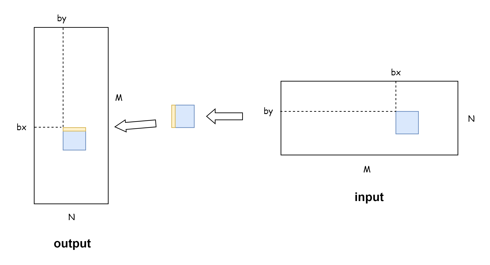

# CUDA_Kernel_Samples
## 引言
本项目是 CUDA **算子手撕与面试指南**：
1. 汇总了面试高频的 CUDA 算子题目和优化策略，包含面试高频算子的编写示例
2. 项目从算子 naive 实现到优化版本均包含完整代码，便于调试与性能分析
3. 每个算子附有相关的 GPU 知识点，帮助求职者高效备战 CUDA 编程面试

目前覆盖以下 CUDA 常见算子及其优化版本：

|     文件夹     |    描述    |                内容                 | 考察频率 |
| :---------: | :------: | :-------------------------------: | :--: |
|   example   | 一些简单的例子  |                 /                 |  /   |
| elementwise | 数组对应元素计算 |                add                |  低   |
|    gemv     |  矩阵乘向量   |               sgemv               |  低   |
|   reduce    |  归约计算优化  | sum, max, softmax, softmax_matrix |  高   |
|    sgemm    |  矩阵乘优化   | naive, blocktile, threadtile, ... |  中   |
|  transpose  |  矩阵转置优化  |    naive, 优化访存并解决bank conflict    |  中   |


## 算子手撕说明
面试时不会提供 CUDA 运行环境，也不会要求完整写出可以运行的代码，通常只需要写出 CUDA 算子函数（大部分情况只需要写这个），block_size，grid_size 和函数调用。

在此列出一些宏，后面会用到：
```cpp
// 1. 向上取整
#define CEIL(a, b) ((a + b - 1) / (b))

// 2. FLOAT4，用于向量化访存，以下两种都可以
// c写法
#define FLOAT4(value) *(float4*)(&(value))

// c++写法
#define FLOAT4(value) (reinterpret_cast<float4*>(&(value))[0])
```

**本文剩余篇幅从这一角度出发，展示必要的代码，以供参考和练习。**

# elementwise
**考察频率**：<span style="color: blue; font-weight: bold;">低</span>

**算子描述**：elementwise 是最简单的**一类算子**，其指的是对数据进行逐元素操作，例如将两个等长的数组对应元素相加（[add](./elementwise/add.cu)）。另外在深度学习中，激活函数会对输入数据的每个元素求对应激活值，故激活函数也算在 elementwise 范围内。

算子主要分两种写法：
1. naive：每个线程负责一个元素的运算
2. 使用**float4**等向量化访存方式：只对大规模数据有加速效果，需要注意，**要在 grid 上除以 4**，而不是在 block 上除以 4，否则会降低SM的占用率，可以参考👉[grid_size 和 block_size 选择](https://blog.csdn.net/LostUnravel/article/details/135721041)，grid_size 不小于 SM上最大同时执行的线程数/最大同时执行的线程块数 (Occupancy)，向量化存取的好处在于可以提高带宽利用率，减少缓存利用率。

**源码文件夹**：[./elementwise](./elementwise)

## add

源码：[./elementwise/add.cu](./elementwise/add.cu)

### naive版
```cpp
// block_size，grid_size 和函数调用
int block_size = 1024;
int grid_size  = CEIL(N, block_size);
elementwise_add<<<grid_size, block_size>>>(a, b, c, N);

// 函数定义
__global__ void elementwise_add(float* a, float* b, float *c, int N) {
    int idx = blockDim.x * blockIdx.x + threadIdx.x;
    if (idx < N) {
        c[idx] = a[idx] + b[idx];
    }
}
```

### 使用向量化访存
使用向量化访存进行优化，需要注意，**要在 grid 上除以 4**：

```cpp
int block_size = 1024;
int grid_size  = CEIL(CEIL(N,4), block_size);  // 注：在grid维度除以4
elementwise_add<<<grid_size, block_size>>>(a, b, c, N);

__global__ void elementwise_add_float4(float* a, float* b, float *c, int N) {
    int idx = (blockDim.x * blockIdx.x + threadIdx.x) * 4;

    if (idx < N) {
        float4 tmp_a = FLOAT4(a[idx]);
        float4 tmp_b = FLOAT4(b[idx]);
        float4 tmp_c;
        tmp_c.x = tmp_a.x + tmp_b.x;
        tmp_c.y = tmp_a.y + tmp_b.y;
        tmp_c.z = tmp_a.z + tmp_b.z;
        tmp_c.w = tmp_a.w + tmp_b.w;
        FLOAT4(c[idx]) = tmp_c;
    }
}
```

以下算子的 block_size, grid_size, 函数调用与 add 的写法相同, 不再重复写出。

## sigmoid

$$\sigma(x) = \frac{1}{1 + e^{-x}} $$

```cpp
__global__ void sigmoid(float* x, float* y, int N) {
    int idx = blockIdx.x * blockDim.x + threadIdx.x;
    if (idx < N) y[idx] = 1.0f / (1.0f + expf(-x[idx]));
}

// float4
__global__ void sigmoid_float4(float* x, float* y, int N) {
    int idx = (blockDim.x * blockIdx.x + threadIdx.x) * 4;
    if (idx < N) {
        float4 tmp_x = FLOAT4(x[idx]);
        float4 tmp_y;
        tmp_y.x = 1.0f / (1.0f + expf(-tmp_x.x));
        tmp_y.y = 1.0f / (1.0f + expf(-tmp_x.y));
        tmp_y.z = 1.0f / (1.0f + expf(-tmp_x.z));
        tmp_y.w = 1.0f / (1.0f + expf(-tmp_x.w));
        FLOAT4(y[idx]) = tmp_y;
    }
}
```

## relu

$$ \text{ReLU}(x) = \max(0, x) $$

```cpp
__global__ void relu(float* x, float* y, int N) {
    int idx = blockDim.x * blockIdx.x + threadIdx.x;
    if (idx < N) y[idx] = fmaxf(0.0f, x[idx]);
    }

// float4
__global__ void relu_float4(float* x, float* y, int N) {
    int idx = (blockDim.x * blockIdx.x + threadIdx.x) * 4;
    if (idx < N) {
        float4 tmp_x = FLOAT4(x[idx]);
        float4 tmp_y;
        tmp_y.x = fmaxf(0.0f, tmp_x.x);
        tmp_y.y = fmaxf(0.0f, tmp_x.y);
        tmp_y.z = fmaxf(0.0f, tmp_x.z);
        tmp_y.w = fmaxf(0.0f, tmp_x.w);
        FLOAT4(y[idx]) = tmp_y;
    }
}
```

# reduce
**考察频率**：<span style="color: red; font-weight: bold;">高</span>

**算子描述**：reduce 是一种聚合操作，通常用于将一个多元素的数据结构（如数组或张量）通过某种规则归约为一个更小的数据结构（通常是单个值或更小的数组）。它广泛应用于数据处理、并行计算以及深度学习中。例如对数组进行求和 (sum)，求均值 (mean)，求最大值 (max)，还有求 softmax。其中，**sum 和 softmax 的考察频率最高**。

**源码文件夹**：[./reduce](./reduce)

## sum

源码：[./reduce/sum/sum.cu](./reduce/sum/sum.cu)

### naive版

每个线程通过原子函数 `atomicAdd`，往同一个全局内存里面写数据，原子函数会导致线程变成序列化，丧失并行性，算子性能大大降低，不能滥用：

```cpp
dim3 block_size(BLOCK_SIZE);  // BLOCK_SIZE 是通过宏定义的某个数字
dim3 grid_size(CIEL(N, BLOCK_SIZE));
reduce_v1<<<grid_size, block_size>>>(d_x, d_y, N);

__global__ void reduce_v1(const float* input, float* output, int N) {
    int idx = blockDim.x * blockIdx.x + threadIdx.x;
    if (idx < N) atomicAdd(output, input[idx]);
}
```

### 折半归约

在block内进行折半归约，一个block归约一部分，先搬到自己 block 内的 shared_memory 下，然后归约到首元素。

> 这种方法的缺点是 BLOCK_SIZE 必须是 2 的幂次，否则折半操作时会计算出错，导致误差很大。而且每次迭代折半时必须使用 `__syncthreads()` 进行同步，会强制所有线程在同步点等待，直到线程块中的其他线程也到达。会导致性能下降。

```cpp
dim3 block_size(BLOCK_SIZE);  // BLOCK_SIZE 是通过宏定义的某个数字
dim3 grid_size(CIEL(N, BLOCK_SIZE));
reduce_v2<<<grid_size, block_size>>>(d_x, d_y, N);

__global__ void reduce_v2(const float* input, float* output, int N) {
    int tid = threadIdx.x;
    int idx = blockDim.x * blockIdx.x + threadIdx.x;
    __shared__ float input_s[BLOCK_SIZE];

    // 1. 搬运和线程数量(blockDim.x)相等的数据，到当前block的共享内存中
    input_s[tid] = (idx < N) ? input[idx] : 0.0f;
    __syncthreads();

    // 2. 用1/2, 1/4, 1/8...的线程进行折半归约
    for (int offset = blockDim.x >> 1; offset > 0; offset >>= 1) {
        if (tid < offset) {  // 2.折半归约
            input_s[tid] += input_s[tid + offset];
        }
        __syncthreads();
    }

    // 3. 每个block的第一个线程将计算结果累加到输出中
    if (tid == 0) atomicAdd(output, input_s[0]);
}
```

### warp shuffle（推荐写法）

在 warp 内进行折半归约，其优势在于，一个 warp 内的线程是同步的，相比于以 block 为单位进行折半，以 warp 为单位进行每次折半时不需要 `__syncthreads()`，并行性更高。 

> BLOCK_SIZE需要是32的整数倍，否则产生线程数不足32的warp，可能会导致访问到无效数据。

**使用 CUDA 提供的 warp shuffle 操作**，有以下函数可以用：

1. `__shfl_sync()`：拷贝来自任意laneId(0~31)线程里的值
2. `__shf_xor_sync()`：拷贝来自一个计算出来的laneId(0~31)线程里的值
3. `__shfl_up_sync()`：拷贝来自有一定偏移量laneId更小的线程里的值
4. `__sync_down_sync()`：拷贝来自有一定偏移量laneId更大的线程里的值

其中 `__shf_xor_sync()` 和 `__sync_down_sync()` 使用频率较高。

```cpp
dim3 block_size(BLOCK_SIZE);
dim3 grid_size(CIEL(N, BLOCK_SIZE));
reduce_v3<<<grid_size, block_size>>>(d_x, d_y, N)

__global__ void reduce_v3(float* d_x, float* d_y, const int N) {
    __shared__ float s_y[32];  // 仅需要32个，因为一个block最多1024个线程，最多1024/32=32个warp

    int idx = blockDim.x * blockIdx.x + threadIdx.x;
    int warpId = threadIdx.x / warpSize;  // 当前线程属于哪个warp
    int laneId = threadIdx.x % warpSize;  // 当前线程是warp中的第几个线程

    float val = (idx < N) ? d_x[idx] : 0.0f;  // 搬运d_x[idx]到当前线程的寄存器中
    #pragma unroll
    for (int offset = warpSize >> 1; offset > 0; offset >>= 1) {
        val += __shfl_down_sync(0xFFFFFFFF, val, offset);   // 在一个warp里折半归约
    }

    if (laneId == 0) s_y[warpId] = val;  // 每个warp里的第一个线程，负责将数据存储到shared mem中
    __syncthreads();

    if (warpId == 0) {  // 使用每个block中的第一个warp对s_y进行最后的归约
        int warpNum = blockDim.x / warpSize;  // 每个block中的warp数量
        val = (laneId < warpNum) ? s_y[laneId] : 0.0f;
        for (int offset = warpSize >> 1; offset > 0; offset >>= 1) {
            val += __shfl_down_sync(0xFFFFFFFF, val, offset);
        }
        if (laneId == 0) atomicAdd(d_y, val);  // 使用此warp中的第一个线程，将结果累加到输出
    }
}
```

### warp shuffle + float4
在 warp shuffle 上进一步优化，搬运数据时使用 float4：

```cpp
#define FLOAT4(value) (float4*)(&(value))[0]
dim3 block_size(BLOCK_SIZE);
dim3 grid_size(CEIL(CIEL(N, BLOCK_SIZE),4));  // 这里要除以4
reduce_v3<<<grid_size, block_size>>>(d_x, d_y, N)

__global__ void reduce_v4(float* d_x, float* d_y, const int N) {
    __shared__ float s_y[32];
    int idx = (blockDim.x * blockIdx.x + threadIdx.x) * 4;  // 这里要乘以4
    int warpId = threadIdx.x / warpSize;   // 当前线程位于第几个warp
    int laneId = threadIdx.x % warpSize;   // 当前线程是warp中的第几个线程
    float val = 0.0f;
    if (idx < N) {
        float4 tmp_x = FLOAT4(d_x[idx]);
        val += tmp_x.x;
        val += tmp_x.y;
        val += tmp_x.z;
        val += tmp_x.w;
    }
    #pragma unroll
    for (int offset = warpSize >> 1; offset > 0; offset >>= 1) {
        val += __shfl_down_sync(0xFFFFFFFF, val, offset);
    }

    if (laneId == 0) s_y[warpId] = val;
    __syncthreads();

    if (warpId == 0) {
        int warpNum = blockDim.x / warpSize;
        val = (laneId < warpNum) ? s_y[laneId] : 0.0f;
        for (int offset = warpSize >> 1; offset > 0; offset >>= 1) {
            val += __shfl_down_sync(0xFFFFFFFF, val, offset);
        }
        if (landId == 0) atomicAdd(d_y, val);
    }
}
```

## SoftMax

Softmax 的 CPU 和 CUDA 写法均是高频考察。面试时有可能会让任选一种写法进行书写，此时自己可以量力而行。

源码：[./reduce/softmax/softmax.cu](./reduce/softmax/softmax.cu)

Softmax公式如下：

$$
\text{Softmax}(x_i) = \frac{e^{x_i}}{\sum_{j=1}^{N} e^{x_j}}
$$

一般为了避免溢出，需要减去最大值，所以通常采用下面这个公式：

$$
\text{Softmax}(x_i) = \frac{e^{x_i-M}}{\sum_{j=1}^{N} (e^{x_j-M})}
$$

其中 $M$ 是输入向量的最大值。

### CPU 写法
```cpp
void softmax(float* input, float* output, int N) {
    int M = *(std::max_element(input, input + N));
    float div = 0;
    for (int i = 0; i < N; i++) {
        output[i] = std::exp(input[i] - M);
        div += output[i];
    }
    for (int i = 0; i < N; i++) {
        output[i] /= div;
    }
}
```

### CUDA写法

最直接的思路是将 Softmax 计算过程拆分为多个归约算子，只要会写归约，那么 Softmax 就能写。

这种写法的优点是比较简单，虽然代码比较多，但基本都是采用归约的写法，几个算子的逻辑上差异不大。缺点是算子效率比较低。**这里建议学习 [softmax_matrix](#softmax_matrix) 的写法！**

思路：
- 核函数1：归约求最值 max_val
- 核函数2：归约求和 sum
- 核函数3：计算每个元素减去 max_val 除以 sum。

```cpp
__device__ static float atomicMax(float* address, float val) {
    int* address_as_i = (int*)address;
    int old = *address_as_i;
    int assumed;
    do {
        assumed = old;
        old = atomicCAS(address_as_i, assumed, __float_as_int(fmaxf(val, __int_as_float(assumed))));
    } while (assumed != old);
    return __int_as_float(old);
}

__global__ void max_kernel(float* input, float* max_val, int N) {
    __shared__ float s_mem[32];
    int idx = blockDim.x * blockIdx.x + threadIdx.x;
    int warpId = threadIdx.x / warpSize;
    int laneId = threadIdx.x % warpSize;

    float val = (idx < N) ? input[idx] : (-FLT_MAX);
    for (int offset = warpSize >> 1; offset > 0; offset >>= 1) {
        val = fmaxf(val, __shfl_down_sync(0xFFFFFFFF, val, offset));
    }
    if (laneId == 0) s_mem[warpId] = val;
    __syncthreads();

    if (warpId == 0) {
        int warpNum = blockDim.x / warpSize;
        val = (laneId < warpNum) ? s_mem[laneId] : (-FLT_MAX);
        for (int offset = warpSize >> 1; offset > 0; offset >>= 1) {
            val = fmaxf(val, __shfl_down_sync(0xFFFFFFFF, val, offset));
        }
        if (laneId == 0) atomicMax(max_val, val);
    }
}

__global__ void sum_kernel(float* input, float* sum, float* max_val, int N) {
    __shared__ float s_mem[32];
    int idx = blockDim.x * blockIdx.x + threadIdx.x;
    int warpId = threadIdx.x / warpSize;
    int laneId = threadIdx.x % warpSize;

    float val = (idx < N) ? expf(input[idx] - *max_val) : 0.0f;
    for (int offset = warpSize >> 1; offset > 0; offset >>= 1) {
        val += __shfl_down_sync(0xFFFFFFFF, val, offset);
    }
    if (laneId == 0) s_mem[warpId] = val;
    __syncthreads();

    if (warpId == 0) {
        int warpNum = blockDim.x / warpSize;
        val = (laneId < warpNum) ? s_mem[laneId] : 0.0f;
        for (int offset = warpSize >> 1; offset > 0; offset >>= 1) {
            val += __shfl_down_sync(0xFFFFFFFF, val, offset);
        }
        if (laneId == 0) atomicAdd(sum, val);
    }
}

__global__ void softmax_kernel(float* input, float* output, float* sum, float* max_val, int N) {
    int idx = blockDim.x * blockIdx.x + threadIdx.x;
    if (idx < N) output[idx] = expf(input[idx] - *max_val) / (*sum);
}

// 初始化相关变量
// ...
// 调用
int block_size = 256;
int grid_size  = CEIL(N, block_size);
max_kernel<<<gird_size, block_size>>>(input, max_val, N);
sum_kernel<<<gird_size, block_size>>>(input, sum, max_val, N);
softmax_kernel<<<gird_size, block_size>>>(input, output, sum, max_val, N);
```

# transpose
**考察频率**：<span style="color: red; font-weight: bold;">中</span>

**算子描述**：指的是矩阵转置，其中会涉及到 GPU 全局内存的高效访问、bank conflict 知识点。

如何优化全局内存的访问：
1. **尽量合并访问**，即连续的线程读取连续的内存，且尽量让访问的全局内存的首地址是32字节（一次数据传输处理的数据量）的倍数（cudaMalloc分配的至少是256字节整数倍）；
2. 如果不能同时合并读取和写入，则应该**尽量做到合并写入**，因为编译器如果能判断一个全局内存变量在核函数内是只可读的，会自动调用 `__ldg()` 读取全局内存，从而对数据进行缓存，缓解非合并访问带来的影响，但这只对读取有效，写入则没有类似的函数。另外，对于开普勒架构和麦克斯韦架构，需要显式的使用 `__ldg()` 函数，例如 `B[ny * N + nx] = __ldg(&A[nx * N + ny])`。

**源码文件夹**：[./transpose](./transpose)

naive：
```cpp
__global__ void transpose(float* input, float* output, int M, int N) {
    // input的row和col
    int row = blockDim.y * blockIdx.y + threadIdx.y;
    int col = blockDim.x * blockIdx.x + threadIdx.x;

    if (row < M && col < N) {
        output[col * M + row] = input[row * N + col];
    }
}
```

仅合并写入：
```cpp
__global__ void transpose(float* input, float* output, int M, int N) {
    // output的row和col
    int row = blockDim.y * blockIdx.y + threadIdx.y;
    int col = blockDim.x * blockIdx.x + threadIdx.x;

    if (row < N && col < M) {
        output[row * M + col] = __ldg(&input[col * N + row]);  // 合并写入，读取使用__ldg进行缓存
    }
}
```

使用共享内存中转，同时合并读取和写入（**推荐**）：


```cpp
// 输入矩阵是M行N列，输出矩阵是N行M列
dim3 block(32, 32);
dim3 grid(CEIL(M,32), CEIL(N,32));

template <const int BLOCK_SIZE>
__global__ void transpose(float* input, float* output, int M, int N) {
    __shared__ float s_mem[BLOCK_SIZE][BLOCK_SIZE + 1];  // 避免bank conflict
    int bx = blockIdx.x * BLOCK_SIZE;
    int by = blockIdx.y * BLOCK_SIZE;
    int x1 = bx + threadIdx.x;
    int y1 = by + threadIdx.y;

    if (x1 < N && y1 < M) {
        s_mem[threadIdx.y][threadIdx.x] = input[y1 * N + x1];
    }
    __syncthreads();

    int x2 = by + threadIdx.x;
    int y2 = bx + threadIdx.y;
    if (x2 < M && y2 < N) {
        output[y2 * M + x2] = s_mem[threadIdx.x][threadIdx.y];  // padding后，不存在bank conflict
    }
}
```

# sgemm
**考察频率**：<span style="color: red; font-weight: bold;">中</span>

**算子描述**：指的是矩阵乘。矩阵乘是 CUDA 学习时的经典案例，涉及多种 CUDA 编程中的常用优化技巧。建议阅读 [./sgemm/README.md](./sgemm/README.md)。但手撕时难度往往较大，建议优先掌握最简单的 naive 版本以及 block_tile 版本。掌握 block_tile 版本后，只需要加一些代码就可以优化为 thread_tile 版本，故也可以考虑掌握。其余的更高效的优化版本，个人认为了解其原理即可，不必强求面试时手写。

**源码文件夹**：[./sgemm](./sgemm)

## naive 版
```cpp
// C(MxN) = A(MxK) * B(KxN) 行优先
// 每个线程处理一个输出矩阵中的元素

// 假设 M N K 已经赋值
const int BLOCK_SIZE = 32;
dim3 block(BLOCK_SIZE, BLOCK_SIZE);
dim3 grid((M+BLOCK_SIZE-1)/BLOCK_SIZE, (N+BLOCK_SIZE-1)/BLOCK_SIZE);
sgemm<<<grid, block>>>(d_A, d_B, d_C, M, N, K);

__global__ void sgemm(float* A, float* B, float* C, int M, int N, int K) {
    int col = blockDim.x * blockIdx.x + threadIdx.x;
    int row = blockDim.y * blockIdx.y + threadIdx.y;
    if (row >= M || col >= N) return;

    float accum = 0.0f;
    for (int i = 0; i < K; i++) {
        accum += A[row * K + i] * B[i * N + col];
    }

    C[row * N + col] = accum;
}
```
## block_tile 版本
还是一个线程计算一个输出矩阵中的元素，但是用 shared mem 做缓存，重复从 shared mem 中读取，而不是从 global mem，虽然读取次数没变少，但是 shared mem 比 global mem 读取速度快：

```cpp
#define BLOCK_SIZE 32

dim3 block(BLOCK_SIZE, BLOCK_SIZE);
dim3 grid(CEIL(M,BLOCK_SIZE), CEIL(N,BLOCK_SIZE));
sgemm<<<grid, block>>>(d_A, d_B, d_C, M, N, K);

__global__ void sgemm(float* A, float* B, float* C, int M, int N, int K) {
    int idx = blockDim.x * blockIdx.x + threadIdx.x;
    int idy = blockDim.y * blockIdx.y + threadIdx.y;
    if (idx >= M || idy >= N) return;

    int bx = blockIdx.x;
    int by = blockIdx.y;
    int tx = threadIdx.x;
    int ty = threadIdx.y;

    const int BM = BLOCK_SIZE;
    const int BN = BLOCK_SIZE;
    const int BK = BLOCK_SIZE;
    __shared__ float As[BM * BK];
    __shared__ float Bs[BK * BN];

    // 初始化block tile起始位置
    A = &A[(by * BM) * K];
    B = &B[bx * BN];
    C = &C[(by * BM) * N + bx * BN];

    float accum = 0.0f;
    for (int k = 0; k < K; k += BK) {
        // 搬运 global ==> shared
        As[ty * BK + tx] = A[ty * K + tx];
        Bs[ty * BN + tx] = B[ty * N + tx];
        __syncthreads();
        A = A + BK;
        B = B + BK * N;
        for (int i = 0; i < BK; i++) {
            accum += As[ty * BK + i] * Bs[i * BN + tx];
        }
        __syncthreads();
    }

    C[ty * N + tx] = accum;
}
```

## thread_tile

一个线程承担更多的计算，更加高效：

```cpp
dim3 block(256);
dim3 grid(CEIL(M,128), CEIL(N,128));
sgemm<128, 128, 8, 8, 8><<<grid, block>>>(A,B,C,M,N,K);

template<const int BM,
         const int BN,
         const int BK,
         const int TM,
         const int TN>
__global__ void sgemm(float* A, float* B, float* C, int M, int N, int K) {
    int bx = blockIdx.x;
    int by = blockIdy.y;

    int block_row_thread = BN / TN;  // block中一行的thread数量
    int block_col_thread = BM / TM;  // block中一列的thread数量
    int thread_num = block_row_thread * block_col_thread;  // block中thread总量

    int tx = (threadIdx.x % block_row_thread) * TN;  // threadtile左上角x坐标
    int ty = (threadIdx.x / block_row_thread) * TM;  // threadtile左上角y坐标

    __shared__ float As[BM * BK];
    __shared__ float Bs[BK * BN];

    A = &A[by * BM * K];
    B = &B[bx * BN];
    C = &C[by * BM * N + bx * BN];

    int a_tile_row = threadIdx.x / BK;
    int a_tile_col = threadIdx.x % BK;
    int a_tile_stride = thread_num / BK;  // BM/(BM/(thread_num/BK)) = thread_num/BK = stride

    int b_tile_row = threadIdx.x / BN;
    int b_tile_col = threadIdx.x % BN;
    int b_tile_stride = thread_num / BN;

    float accum[TM][TN] = {0.0f};
    for (int k = 0; k < K; k += BK) {
        for (int i = 0; i < BM; i += a_tile_stride) {
            As[(a_tile_row + i) * BK + a_tile_col] = A[(a_tile_row + i) * K + a_tile_col];
        }
        for (int i = 0; i < BK; i += b_tile_stride) {
            Bs[(b_tile_row + i) * BN + b_tile_col] = B[(b_tile_row + i) * N + b_tile_col];
        }
        __syncthreads();

        A += BK;
        B += BK * N;

        for (int row = 0; row < TM; row++) {
            for (int col = 0; col < TN; col++) {
                for (int i = 0; i < BK; i++) {
                    accum[row][col] += As[(ty + row) * BK + i] * Bs[i * BN + (tx + col)];
                }
            }
        }
        __syncthreads();
    }
    for (int row = 0; row < TM; row++) {
        for (int col = 0; col < TN; col++) {
            C[(ty + row) * N + (tx + col)] = accum[row][col];
        }
    }
}
```

# gemv
**考察频率**：<span style="color: blue; font-weight: bold;">低</span>

**算子描述**：求一个矩阵乘以一个向量，方法是每个block中有一个warp，每个warp负责一行的计算。虽然面试考察频率不大但，推荐学习并了解。因为 gemv 中使用一个 warp 负责一行的计算方式，可以拓展到对一个矩阵按行求归约（**面试时有概率会考察二维矩阵的按行求归约，而不只是一维数组**）

**源码文件夹**：[./gemv](./gemv)

## gemv
```cpp
// 行数: M = 1024
// 列数: K = 32
// block数量和行数相同: grid_size = M
// 每个block里一个warp: block_size = 32
sgemv<<<grid_size, block_size>>>(A, x, y, M, K);
__global__ void sgemv(float* A, float* x, float* y, int M, int K) {
    int laneId = threadIdx.x % warpSize;
    int row = blockIdx.x;  // 0~M-1
    if (row >= M) return;

    float res = 0.0f;
    int kIteration = CEIL(K, warpSize);  // 每个线程需要负责计算的数据个数

    for (int i = 0; i < kIteration; i++){
        int col = i * warpSize + laneId;
        res += (col < K) ? A[row * K + col] * x[col] : 0.0f;
    }

    for (int offset = warpSize >> 1; offset > 0; offset >>= 1) {
        res += __shfl_down_sync(0xFFFFFFFF, res, offset);
    }

    if(laneId == 0) y[row] = res;
}
```

## 拓展应用

了解了 gemv 后，按照同样的思路，我们可以写出对 MxN 的矩阵，每一行求 softmax。M = 1 时，问题变为对一个长度为 N 的数组求 softmax。

### softmax_matrix

源码：[./reduce/softmax_matrix/softmax_matrix.cu](./reduce/softmax_matrix/softmax_matrix.cu)

对一个 MxN 的矩阵，每一行求 softmax，思路同样是每个 warp 处理一行，用这个 warp 对一行进行求和、求最值，计算结果存入共享内存，然后每个元素求 softmax：
```cpp
__global__ void softmax_kernel(float* input, float* output, int M, int N) {
    __shared__ float s_max_val;
    __shared__ float s_sum;
    int laneId = threadIdx.x % warpSize;
    // 当前行
    int row = blockIdx.x;
    if (row >= M) return;

    int iteration = CEIL(N, warpSize);  // 每个线程负责计算的数据个数

    // 求每一行最大值
    float max_val = -FLT_MAX;
    for (int i = 0; i < iteration; i++) {
        int col = i * warpSize + laneId;
        max_val = (col < N) ? fmaxf(max_val, input[row * N + col]) : max_val;
    }
    for (int offset = warpSize >> 1; offset > 0; offset >>= 1) {
        max_val = fmaxf(max_val, __shfl_down_sync(0xFFFFFFFF, max_val, offset));
    }
    if (laneId == 0) s_max_val = max_val;  // 最大值汇总到第一个线程，第一个线程将它搬运到s_mem

    // 求每一行的和，且要减去最大值
    float sum = 0.0f;
    for (int i = 0; i < iteration; i++) {
        int col = i * warpSize + laneId;
        sum += (col < N) ? expf(input[row * N + col] - s_max_val) : 0.0f;
    }
    for (int offset = warpSize >> 1; offset > 0; offset >>= 1) {
        sum += __shfl_down_sync(0xFFFFFFFF, sum, offset);
    }
    if (laneId == 0) s_sum = sum;  // sum值汇总到第一个线程，第一个线程将它搬运到s_mem

    // 计算每一行的softmax
    for (int i = 0; i < iteration; i++) {
        int col = i * warpSize + laneId;
        if (col < N) output[row * N + col] = expf(input[row * N + col] - s_max_val) / s_sum;
    }
}
```

改用 `__shfl_xor_sync` 后，每个线程的寄存器的 `max_val` 和 `sum` 都是最终的结果，就不用写到共享内存再读取了：
```cpp
dim3 block(32);
dim3 grid(M);

__global__ void softmax_kernel(float* input, float* output, int M, int N) {
    int laneId = threadIdx.x % warpSize;
    // 当前行
    int row = blockIdx.x;
    if (row >= M) return;

    int iteration = CEIL(N, warpSize);  // 每个线程负责计算的数据个数

    // 求每一行最大值
    float max_val = -FLT_MAX;
    for (int i = 0; i < iteration; i++) {
        int col = i * warpSize + laneId;
        max_val = (col < N) ? fmaxf(max_val, input[row * N + col]) : max_val;
    }
    for (int offset = warpSize >> 1; offset > 0; offset >>= 1) {
        max_val = fmaxf(max_val, __shfl_xor_sync(0xFFFFFFFF, max_val, offset));
    }

    // 求每一行的和，且要减去最大值
    float sum = 0.0f;
    for (int i = 0; i < iteration; i++) {
        int col = i * warpSize + laneId;
        sum += (col < N) ? expf(input[row * N + col] - max_val) : 0.0f;
    }
    for (int offset = warpSize >> 1; offset > 0; offset >>= 1) {
        sum += __shfl_xor_sync(0xFFFFFFFF, sum, offset);
    }

    // 计算每一行的softmax
    for (int i = 0; i < iteration; i++) {
        int col = i * warpSize + laneId;
        if (col < N) output[row * N + col] = expf(input[row * N + col] - max_val) / sum;
    }
}
```

进一步地，**当行数 M = 1，问题退化为对一个长度为 N 的数组进行归约求和**。可以自行编写。