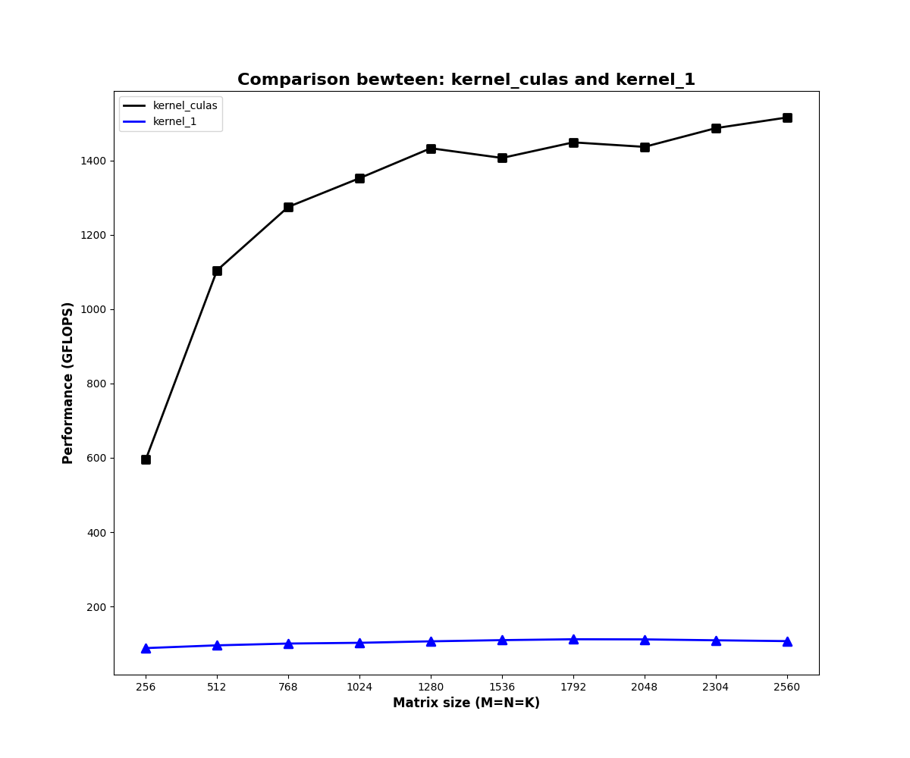

# CUDA SGEMM 优化
## 开发环境
设备：NVIDIA GeForce GTX 1050

## 开发流程
1. 在src下编写kernel.cu
2. 在include编写对应头文件，并在include/kernel.cuh中包含该头文件
3. 编译：
```bash
mkdir build && cd build
cmake ..
make
```
4. 运行：
```bash
# run cuBLAS(0) or custom kernel(>0)
./main 0  # cuBLAS
./main 1  # kernel1
...
```
5. 测试并画图：
```bash
bash tools/test.sh  # 日志保存在./test, 图片保存在./images
```

## Kernel1：Native 实现

将每个逻辑线程与矩阵C的每一个元素相对应，每个线程负责C中一个元素的计算；

未经过优化的矩阵乘法性能不足CUBLAS的1/10，具体分析如下；

计算访存比：每次迭代需要进行一次FMA（乘累加）和两次全局内存读取，计算访存比1/2；
访存量：访问全局内存，C矩阵每个元素计算需要访问2K个单精度浮点数，完成全部计算需要 $2*K*M*N$；
全局内存访问延迟高（几百cycle），同时相同位置元素被重复读取（C中同一行元素计算共享A中同一行元素，C中同一列元素计算共享B中同一列元素），另一方面，较低的计算访存比无法有效隐藏访存延迟，因此，访存延迟和计算访存比是导致kernel 1效率低下的原因。

# 参考
1. https://github.com/wangzyon/NVIDIA_SGEMM_PRACTICE