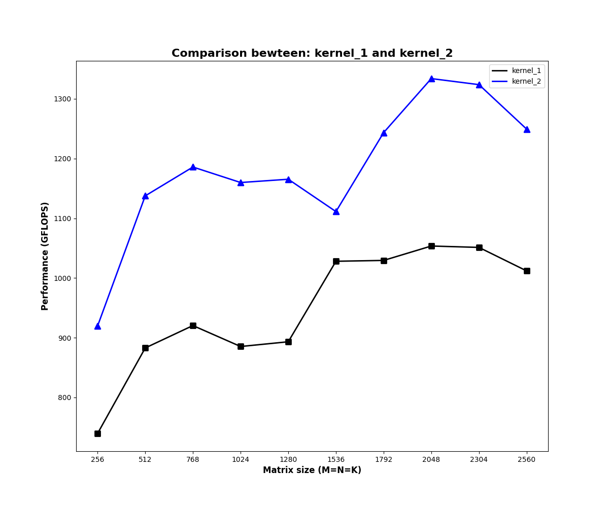
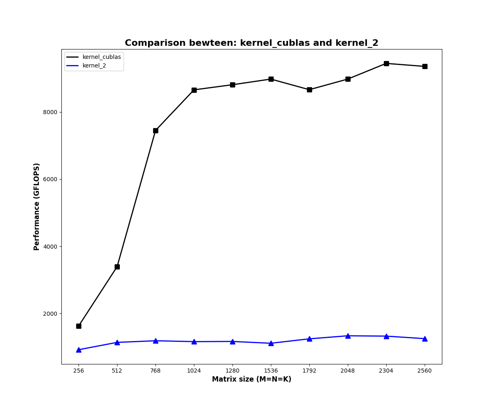

# CUDA SGEMM 优化
## 开发环境
设备：NVIDIA GeForce GTX 1050
```
Device ID: 0
       *Number of SMs: 5
       Compute Capability Major: 6
       Compute Capability Minor: 1
       memoryBusWidth: 128
       *maxThreadsPerBlock: 1024
       maxThreadsPerMultiProcessor: 2048
       *totalGlobalMem: 2047M
       sharedMemPerBlock: 48KB
       *sharedMemPerMultiprocessor: 96KB
       totalConstMem: 64KB
       *multiProcessorCount: 5
       *Warp Size: 32
```

## 开发流程
1. 在src下编写kernel.cu
2. 在include下编写对应头文件，并在include/kernel.cuh中包含该头文件
3. 在src/utils.cu的call_kernel函数中调用编写的kernel
4. 编译：
```bash
mkdir build && cd build
cmake ..
make
```
5. 运行：
```bash
# run cuBLAS(0) or custom kernel(>0)
./main 0  # cuBLAS
./main 1  # kernel1
...
```
6. 测试并画图：
```bash
pip install matplotlib
bash tools/test.sh  # 日志保存在./test, 图片保存在./images
```

## CUDA名词解释
- “访存量”（memory access）通常指的是GPU核心（CUDA核心）或线程所需从全局内存中读取或写入的数据量。

## Kernel1：Native 实现 (global memory)
<div align=center>

</div>

### 代码
```cpp
__global__ __launch_bounds__(1024) 
void sgemm_v1(int M, int N, int K, float alpha, float *A, float *B, float beta, float *C) {

    int id_x = blockIdx.x * blockDim.x + threadIdx.x; // id x
    int id_y = blockIdx.y * blockDim.y + threadIdx.y; // id y

    float tmp = 0.;
    for (int i = 0; i < K; i++) {
        tmp += A[id_y * K + i] * B[i * N + id_x]; // 两次全局内存访问和一次FMA（累加乘）
    }
    C[id_y * N + id_x] = alpha * tmp + beta * C[id_y * N + id_x];
}
```

### 计算步骤 (图解)
将每个逻辑线程与矩阵C的每一个元素相对应，每个线程负责C中一个元素的计算：
<div align=center>

</div>

### 分析
未经过优化的矩阵乘法性能不足cuBLAS的1/10，具体分析如下：

1. **访存比低**：每次迭代需要进行一次FMA（乘累加）和两次全局内存读取，计算访存比1/2；
2. **访存延迟高**：访问**全局内存**，**延迟高**，需要几百个时钟周期 (cycle)
3. **较低的访存比无法有效隐藏访存延迟**
4. 访存量：矩阵C的每个元素计算需要访问2K个单精度浮点数，完成全部计算需要 $2\times K\times M\times N$
5. 相同位置元素被重复读取（C中同一行元素计算共享A中同一行元素，C中同一列元素计算共享B中同一列元素）

> 动态全局内存是在运行时动态分配的内存，**所有线程**可见（主机端也可见），使用 `cudaMalloc()` 和 `cudaFree()` 函数来分配和释放。

## Kernel2：从 global memory 到 shared memory
<div align=center>

</div>

### 计算步骤 (图解)
<div align=center>

</div>
<div align=center>

</div>

如上图左边所示，矩阵乘时，矩阵C的每一个行中的结果在计算时，都要重复读取矩阵A中的同一行（同理，矩阵C的每一个列中的结果在计算时，都要重复读取矩阵B中的同一列）。

利用这个特点，可以把A、B、C按 $BM\times BK$，$BK\times BN$，$BM\times BN$ 的切分，三个矩阵形成$\frac{M}{BM}\times \frac{K}{BK}$，$\frac{K}{BK}\times \frac{N}{BN}$，$\frac{M}{BM}\times \frac{N}{BN}$的网格，如上图右边所示：
1. 在block中申请等同于块大小的共享内存，每个 block 从全局内存 (global memory) 中读取数据并保存在共享内存中
2. 由于块的尺寸大于$1\times 1$，所以读取全局内存的次数会按块的尺寸成倍减小
3. 因为共享内存在一个 block 中是共享的，这样一个block内的元素在重复读取同一行（列）时，可以直接从共享内存中读取
4. 尽管总的读取次数增加了（上图中全局内存的访问次数变为原来的一半，共享内存的访问次数等于native实现的读取次数），但是全局内存的访问次数显著减少，而共享内存的访问次数虽然很多但由于共享内存的访问延迟是远小于全局内存的，所以**总的访问延迟还是显著减小**的

### 分析
性能相比kernel1有所提升，但相比cuBLAS的实现，差距还是很大，具体分析如下：

1. **访存量显著减小**：完成C中所有元素的计算一共需要从global memory中读取 $\frac{M}{BM}\times \frac{N}{BN} \times \frac{K}{BK} \times (BM \times BK+BK \times BN)=M \times N \times K \times (\frac{1}{BM}+ \frac{1}{BN})$，访存量是 kernel1 的 $0.5 \times(\frac{1}{BM}+ \frac{1}{BN})$，代码中使用BM=BN=32，此时访存量变为原来的 1/32；
2. **访存比没有变化**：每次计算仍然需要2个访存指令和1个计算指令。

# 参考
1. https://github.com/wangzyon/NVIDIA_SGEMM_PRACTICE
2. https://zhuanlan.zhihu.com/p/410278370
3. https://zhuanlan.zhihu.com/p/435908830